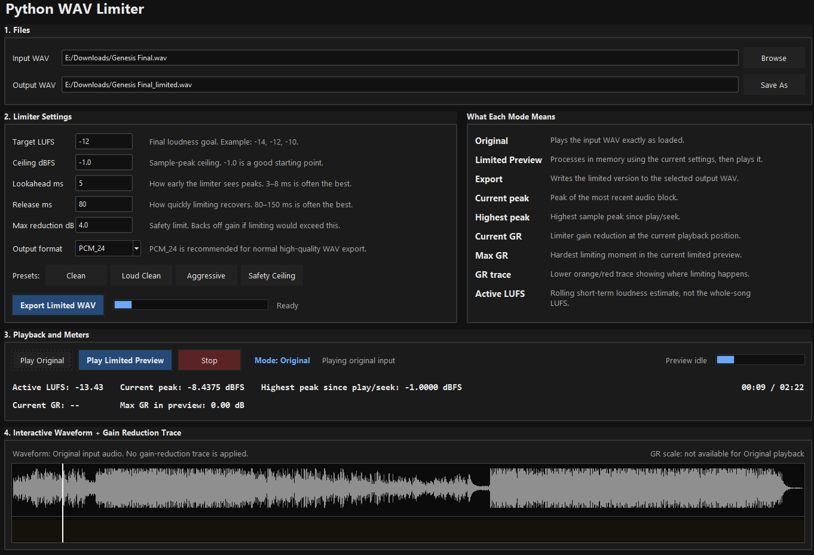

# Python WAV Limiter

## Screenshots



A desktop WAV limiting and loudness-targeting tool built with Python and Tkinter.

This app loads a WAV file, previews the original and limited versions, displays peak/LUFS/gain-reduction meters, shows an interactive waveform with a gain-reduction trace, and exports a processed WAV file.

## Features

* Offline WAV processing
* LUFS target gain
* Sample-peak ceiling control
* Maximum gain-reduction safety limit
* Original audio playback
* Limited preview playback
* Interactive waveform seeking
* Current peak meter
* Highest peak since play/seek meter
* Rolling active LUFS estimate
* Current and maximum gain-reduction meters
* Visual gain-reduction trace
* Export as PCM 24-bit, PCM 16-bit, or float WAV
* Presets

## Requirements

Python 3.11 is recommended.

Install dependencies with:

```bash
pip install numpy soundfile sounddevice pyloudnorm
```

The app uses:

* `tkinter` for the desktop interface
* `numpy` for audio array processing
* `soundfile` for WAV reading/writing
* `sounddevice` for playback
* `pyloudnorm` for LUFS measurement

## How to Run

Clone or download this repository, then run:

```bash
python Limiter.py
```

On Windows with the Python launcher:

```powershell
py -3.11 .\Limiter.py
```

## Project Files

```text
Limiter.py          Main Tkinter user interface
Limiter_Engine.py   Audio processing engine
```

## Basic Usage

1. Choose an input WAV file.
2. Choose an output WAV path.
3. Set the target LUFS, ceiling, lookahead, release, and maximum gain reduction.
4. Use **Play Original** to listen to the unprocessed file.
5. Use **Play Limited Preview** to preview the limited version.
6. Check the waveform, peak meters, LUFS estimate, and gain-reduction trace.
7. Use **Export Limited WAV** to render the final file.

## Important Audio Notes

This is an experimental offline audio tool.

The limiter currently uses sample-peak limiting, not full true-peak oversampling. This means the exported file may still produce inter-sample peaks after encoding or conversion. For streaming/mastering use, check the final export with a true-peak meter.

The active LUFS display during playback is a rolling estimate. It is not the same as the full integrated LUFS shown in the export report.

The gain-reduction trace shows where the limiter is reducing gain during the limited preview. Taller orange/red spikes mean stronger limiting.

## Limitations

* WAV-focused workflow
* No true-peak oversampling yet
* No VST/AU plugin support
* Preview rendering can be slow on long files
* The limiter is experimental and should be verified before serious release use
* The interface is designed for desktop use, not mobile or web use

## AI-Assisted Development

This project was developed with AI assistance and manually reviewed, edited, and tested by the author.
